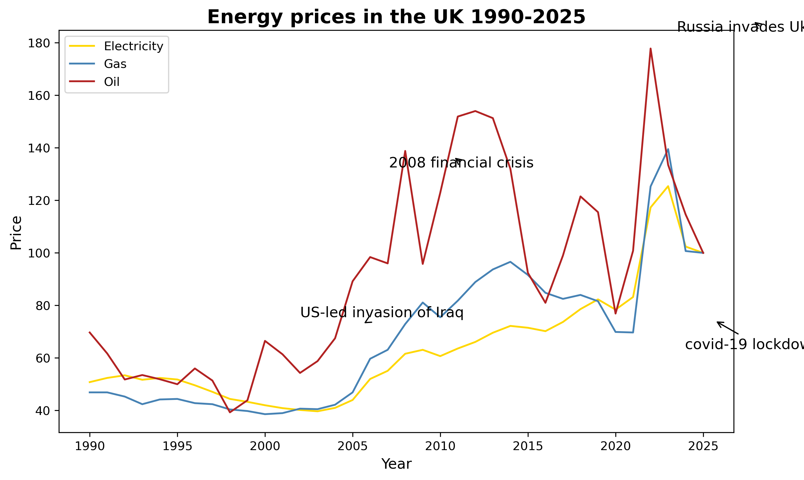

# UK energy prices

A brief look into UK energy price fluctuations and the events that caused them.

Oil is by far the most unstable energy, electricity is the most stable.

The huge rise in the price of oil may have been much worse for the population if it wasn't for the dip beforehand caused by covid-19 lockdowns .